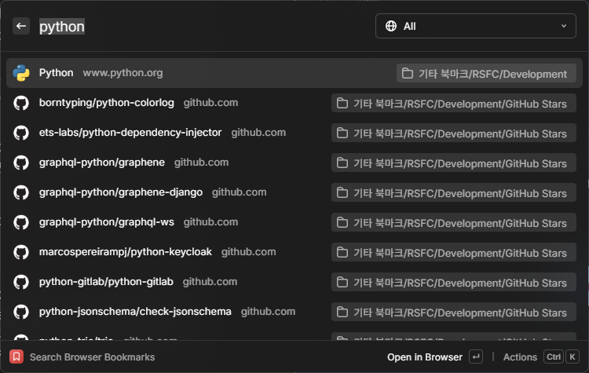

# Raindrop Sync for Chrome

A Chrome browser extension for syncing bookmarks with Raindrop.io.

## ✨ Features

Raindrop Sync for Chrome keeps a local copy of your Raindrop.io bookmarks in Chrome's native bookmark store.

- One-way sync from Raindrop.io to Chrome Bookmarks
- Background sync on startup and periodically
- Release builds are published for installation from the Chrome Web Store

Planned features:

- [ ] Granular synchronization: map query results and collections to specific bookmark folders
- [ ] Two-way sync between Raindrop.io and Chrome Bookmarks
- [ ] Support for additional browsers

## 📱 Use cases

The main reason to use this extension is speed. By storing your Raindrop.io bookmarks directly in Chrome, you can search and browse them without waiting for the official extension's UI.

It also works well with desktop launcher apps. You can browse synced bookmarks through apps like Raycast, Flow Launcher, and Alfred.

For example, you can use the Raycast [Browser Bookmarks](https://www.raycast.com/raycast/browser-bookmarks) plugin to search through Chrome bookmarks directly:

## 🚀 Getting started

> [!WARNING]
> This project is still early. Some workflows are incomplete or buggy, and there is a risk of breaking your bookmarks. Back up your bookmarks before using the extension.

### 🛠️ Install from the Chrome Web Store

For the normal release flow, install the extension from the [Chrome Web Store](https://chromewebstore.google.com/detail/raindrop-sync-for-chrome/iacjnnndmkebkjdcdedfbmccofnmaojf).

### 👟 Setting up the extension

1. Open the extension's Options page.

   Right-click the extension icon, then click Options.

1. Navigate to the **Integration** tab.

1. Follow the instructions to set up the integration.

   

1. Go to the **Bookmarks** tab.

   You can trigger the sync manually by clicking **Start sync**.

   

   You can also trigger a sync from the popup.

   

### 📦 Installing a release build

You can install any published version of the extension, including older releases, by following these steps:

1. Download the prebuilt `.zip` file from the [releases page](https://github.com/lasuillard-s/raindrop-sync-chrome/releases).
1. Extract the archive to a local directory, then open Chrome.
1. Navigate to `chrome://extensions`.
1. Turn on **Developer Mode** in the top-right corner.

   

1. Click **Load unpacked** and select the directory where you extracted the extension.

   

1. Confirm the extension appears in your installed extensions list.

   

## 💖 Contributing

Please refer to [CONTRIBUTING.md](./CONTRIBUTING.md) for more information on how to contribute to this project.

## 📜 License

Copyright (C) 2026 Yuchan Lee

This project is licensed under the GNU General Public License v3.0. See the [LICENSE](./LICENSE) file for more details.
