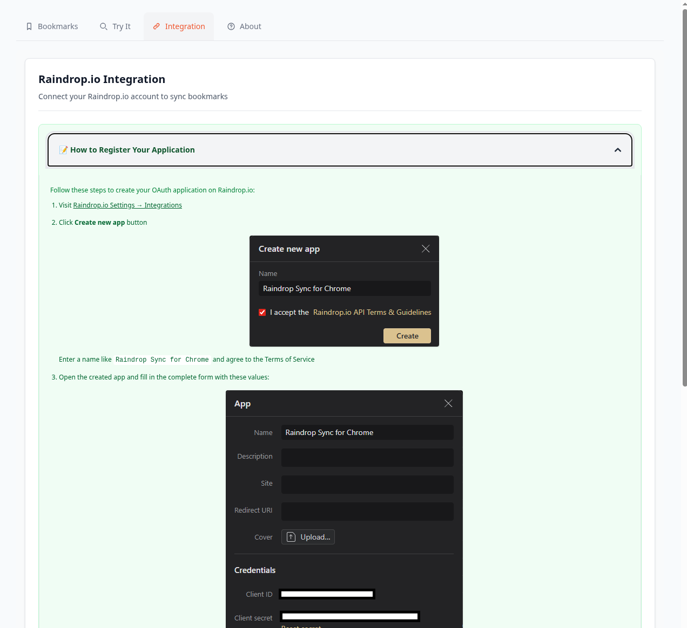
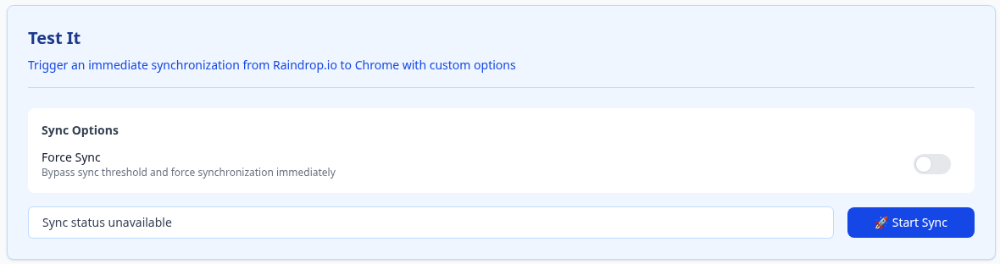
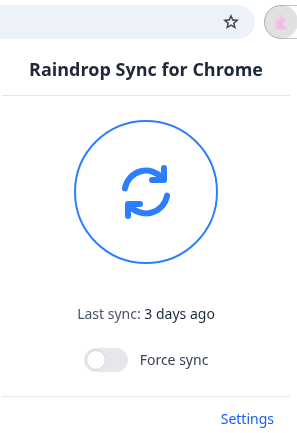

# Raindrop Sync for Chrome

A Chrome browser extension for syncing bookmarks with Raindrop.io.

## ✨ Features

Core features supported:

- [x] One-way sync from Raindrop.io to Chrome Bookmarks

- [x] Background sync on startup and periodically

- [x] Publish the extension to the Chrome Web Store

Planned features:

- [ ] Granular synchronization: map query results and collections to specific bookmark folders

- [ ] Two-way sync between Raindrop.io and Chrome Bookmarks

- [ ] Support for additional browsers

## 🚀 Getting Started

> ❗ **Caution:** This project is currently under development. Many features may be incomplete or buggy.

Visit [Chrome Web Store](https://chromewebstore.google.com/detail/raindrop-sync-for-chrome/iacjnnndmkebkjdcdedfbmccofnmaojf) and install the extension.

### 📦 Installing the Development Version

You can install any version of the extension (including older releases or development builds) by following the steps below:

1. Get the extension archive

    Download the `.zip` file from the [releases page](https://github.com/lasuillard-s/raindrop-sync-chrome/releases) or build it yourself (`make build`).

2. Unzip the archive

    Extract the contents of the downloaded archive to your desired location, then open Chrome.

3. Access Chrome Extensions

    Navigate to `chrome://extensions` in your Chrome browser.

4. Enable Developer Mode

    Toggle **Developer Mode** on in the top-right corner of the page.

    

5. Load the Unpacked Extension

    Click the **Load Unpacked** button and select the directory where you extracted the extension.

    

6. Verify Installation

    You should now see the extension listed among your installed extensions.

    

### 👟 Initializing the Application

> ‼️ **Warning:** This project is in the early stages of development. Many features are incomplete or buggy, and there is a risk of breaking your bookmarks due to poor implementation. We strongly recommend backing up your bookmarks before using this extension.

1. Visit the Options page

    Open the extension's options page (right-click extension icon then click Options).

2. Navigate to the **Integration** tab

3. Follow the instructions to set up the integration

    

4. Go to the **Bookmarks** tab

    You can trigger the sync manually by clicking **Start sync**.

    

    You can also trigger sync from the popup.

    
